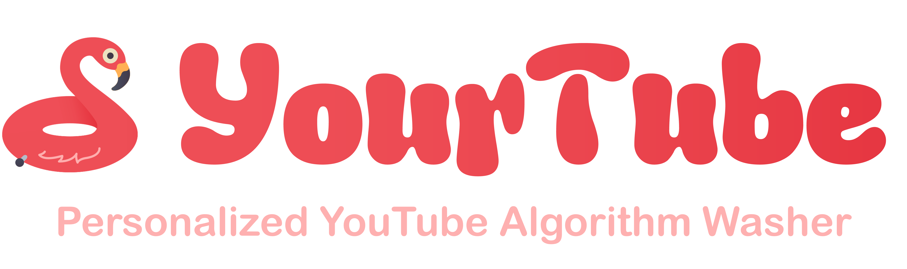

# YourTube

<h3>24-1 YBIGTA 컨퍼런스</h3>

사용자가 원하는대로 YouTube 영상을 분류하는 크롬 확장 프로그램

<!--
$\rm{\large{\color{#ee4e56}YOU}}\large{tube \space algo}\large{\color{#ee4e56}R}\large{ithm \space}\large{\color{#ee4e56}TU}\large{ning \space}\large{\color{#ee4e56}B}\large{rowser \space}\large{\color{#ee4e56}E}\large{xtension}$
-->

<!--
<h6>Compatible with</h6>

<h6>and other Chromium based browsers</h6>
-->

## 목차
- [문제 정의](#문제-정의)
- [세부 목표](#세부-목표)
- [접근 방법](#접근-방법)
- [결과 및 주요 기능](#결과-및-주요-기능)
- [팀 구성](#팀-구성)

## 문제 정의

**프로그램 실행 전**

**프로그램 실행 후**

YouTube 사용자들은 추천 알고리즘으로 인해 자신의 원래 목적과 관련이 없는 컨텐츠를 소비하는 경우가 많다. 이를 해결하기 위해 사용자들은 자신이 관심 있는 채널을 구독하고 해당 채널의 영상을 시청하지만, 구독한 채널이 많고 다양한 경우에는 자신이 원하는 컨텐츠를 찾기 어렵다.

이 문제를 해결하기 위해, 구독한 채널의 컨텐츠를 카테고리별로 분류하고, 사용자가 설정 가능한 세부 카테고리로 나누어 영상을 필터링할 수 있는 크롬 확장프로그램을 개발하고자 하였다. 이 프로그램을 통해 YouTube 사용자는 원하는 컨텐츠를 쉽게 분류하고 탐색하여 시청할 수 있다.

<!--## 선행 연구
*(Optional 필드; 생략해도 무관)*-->

## 세부 목표
1. YouTube API를 이용해 사용자의 YouTube 구독 정보를 가져온다.
2. 사용자가 구독한 채널별로 최신 영상을 15개씩 가져온다.
3. 가져온 영상들을 YouTube 영상 카테고리에 따라 분류한다.
4. 영상들을 각 카테고리별로 사용자가 설정 가능한 세부 카테고리에 따라 분류한다.
5. 분류가 완료된 페이지를 사용자에게 제시한다.

## 접근 방법

1. **태스크**
    - **파이프라인 팀**
        - 데이터베이스 구축
        - Google Cloud Platform을 이용해 서버 구축
        - 프론트엔드 구현
        - 크롬 확장 프로그램 배포
    - **모델링 팀**
        - 영상 카테고리 분류 모델 학습을 위한 데이터셋 수집
        - 영상 카테고리 분류를 위한 BERT 모델 학습
        - 모델 배포 및 서버 연결

2. **데이터셋**
    - YouTube Video Description Dataset
        - YouTube의 영상 7,000개에 대한 세부 정보들을 크롤링하여 직접 구축한 데이터셋.
    - YouTube API
        - 사용자의 구독 채널 목록을 가져오기 위한 API
    - OpenAI API
        - 영상 데이터셋에서 업로더가 카테고리 설정을 안했을 때 설정되는 영상의 Default 카테고리인 22번 카테고리에 대해 재분류를 하기 위해 사용한 API
        - OpenAI의 GPT-4o 모델을 이용해 영상의 제목, 설명, 자막을 바탕으로 영상의 카테고리를 재분류했음.

3. **모델링/아키텍쳐 등**

   
   
   - YouTube API
      - 사용자의 YouTube 구독 채널 목록을 가져온다.
   - 전체 카테고리 분류 모델
      - <a href="https://huggingface.co/google-bert/bert-base-multilingual-cased" target="_blank">BERT Multilingual Base Model (Cased)</a>을 YouTube 영상 데이터셋을 이용해 Fine-Tune한 모델.
      - 구독한 채널의 영상들의 정보를 바탕으로 영상들을 YouTube 기본 제공 카테고리에 맞게 분류한다.
   - 세부 카테고리 분류 모델
      - Sentence Transformer 기반의 <a href="https://huggingface.co/sentence-transformers/paraphrase-MiniLM-L6-v2" target="_blank">paraphrase-MiniLM-L6-v2</a> 모델.
      - 카테고리별로 분류된 영상들을 사용자가 설정 가능한 세부 카테고리를 기준으로 분류한다.
   - Mongo DB
        - 영상들의 세부 정보와 분류된 카테고리 정보를 저장한다.

## 결과 및 주요 기능

**확장 프로그램 실행 화면**

사용자가 직접 최신 영상을 불러오고, 카테고리 분류를 수행할 수도 있다.

**확장 프로그램 실행 후 화면**

사용자가 구독한 영상들이 YouTube에서 제공하는 카테고리별로 분류된 모습.

## 팀 구성

| 이름  | 팀  | 역할  |
|:-----:|:----:|:-----:|
| **[조윤영](https://github.com/younyoungieo)** | DE |  파이프라인  |
| **[김현호](https://github.com/smthswt)** | DE | 파이프라인 |
| **[임종혁](https://github.com/2000may24th)** | DE | 파이프라인 |
| **[김예진](https://github.com/gina261)** | DA | 모델링 |
| **[곽민규](https://github.com/DeokbaeKwak)** | DS | 모델링 |
| **[이승준](https://github.com/aiseungjun)** | DS | 모델링 |
| **[박경욱](https://github.com/danielredglasses)** | DS | 모델링 |
